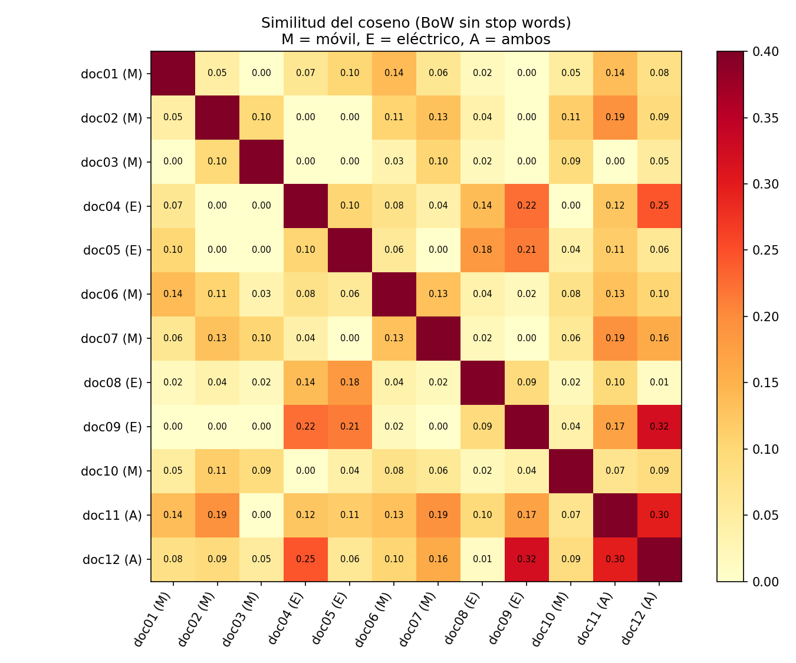

# Informe: similitud de documentos con Bag-of-Words y similitud del coseno

## 1. Metodología

Se trabajó con los 12 documentos proporcionados, leídos directamente de los ficheros `.docx` (título incluido). Cada documento se etiquetó según su tema: **Móvil** (doc01, 02, 03, 06, 07, 10), **Eléctrico** (doc04, 05, 08, 09) y **Ambos** (doc11, 12).

El preprocesamiento consistió en pasar el texto a minúsculas, sustituir por espacios todo carácter no alfabético (puntuación, dígitos, comillas), conservando tildes y ñ, y, opcionalmente, eliminar una lista de *stop words* en español. Con los tokens resultantes se construyó un vocabulario global (465 palabras con stop words, 404 sin ellas) y cada documento se representó como un vector de frecuencias absolutas sobre ese vocabulario. Por último, se calculó la similitud del coseno, `cos(a, b) = a·b / (‖a‖·‖b‖)`, para los 66 pares posibles. Todo está implementado desde cero con NumPy en `similitud_bow.py`, y el experimento se ejecutó en las dos variantes (con y sin stop words) para compararlas.

## 2. Resultados

### 2.1 Efecto de las stop words

Con stop words, todas las similitudes quedan entre 0,27 y 0,68, y los valores apenas distinguen entre temas: la similitud media entre documentos de temas distintos (Eléctrico–Móvil, 0,464) es incluso mayor que entre documentos de vehículos eléctricos (0,459). Esto ocurre porque palabras como *de*, *la*, *que*, *los* o *en* dominan los vectores y son comunes a cualquier texto en español. Además, doc08 aparece como el documento "menos similar" a casi todos, simplemente porque es corto y usa menos palabras funcionales. **Sin eliminar stop words, la similitud mide sobre todo el estilo del idioma, no el contenido.**

Al eliminarlas, las similitudes bajan a un rango de 0,00–0,32 pero pasan a reflejar el tema. El resto del análisis usa esta variante.

### 2.2 Pares más y menos similares (sin stop words)

| Par | Temas | Similitud | Palabras compartidas |
|---|---|---|---|
| doc09 – doc12 | Eléctrico – Ambos | 0,322 | carga, cargar, coches, conductores, eléctricos, estaciones, vehículos… |
| doc11 – doc12 | Ambos – Ambos | 0,298 | carga, conducción, integración, móvil, navegación, smartphones, tecnología… |
| doc04 – doc12 | Eléctrico – Ambos | 0,245 | carga, coches, eléctricos, estaciones, promete |
| doc04 – doc09 | Eléctrico – Eléctrico | 0,225 | |
| doc05 – doc09 | Eléctrico – Eléctrico | 0,213 | |

En el otro extremo, 12 pares tienen similitud exactamente 0 (no comparten ninguna palabra de contenido). De ellos, 10 son pares Móvil–Eléctrico (por ejemplo doc02–doc04, doc02–doc05, doc01–doc09 o doc03–doc09); los otros dos son doc03–doc11 (Móvil–Ambos) y doc01–doc03, un par del mismo tema.

### 2.3 Similitud media por combinación de temas.

| Combinación | Nº de pares | Media (sin stop words) | Media (con stop words) |
|---|---|---|---|
| Ambos – Ambos | 1 | **0,298** | 0,636 |
| Eléctrico – Eléctrico | 6 | **0,159** | 0,459 |
| Ambos – Eléctrico | 8 | 0,143 | 0,512 |
| Ambos – Móvil | 12 | 0,108 | 0,590 |
| Móvil – Móvil | 15 | 0,083 | 0,552 |
| Eléctrico – Móvil | 24 | **0,024** | 0,464 |

## 3. Análisis

**Los documentos del mismo tema son más similares entre sí que los de temas distintos.** Los pares Eléctrico–Móvil tienen la similitud media más baja con diferencia (0,024, cerca de 0), mientras que los pares dentro del mismo tema tienen medias entre 3 y 6 veces mayores.

**Los documentos mixtos actúan como puente.** doc11 y doc12 tienen similitudes intermedias con ambos grupos: se parecen a los de vehículos eléctricos (0,143 de media) y a los de móviles (0,108), y son el par más parecido entre sí. doc12 aparece en tres de los cinco pares más similares, porque su vocabulario (*carga*, *estaciones*, *conductores*, *app*, *smartphones*) solapa con los dos temas.

**El grupo de vehículos eléctricos es más cohesionado que el de móviles.** Los documentos de vehículos eléctricos repiten un vocabulario reducido y muy específico (*eléctrico*, *coche*, *carga*, *autonomía*, *vehículo*), mientras que los de tecnología móvil tratan subtemas muy diversos (pantallas, baterías, apps, seguridad, realidad aumentada) y comparten pocas palabras. Por eso la media Móvil–Móvil (0,083) es inferior incluso a la de Ambos–Móvil, y existen pares del mismo tema con similitud 0 (doc01–doc03).

## 4. Limitaciones y posibles mejoras

El Bag-of-Words solo detecta coincidencias exactas de palabras. Formas como *smartphone*/*smartphones*, *móvil*/*móviles* o *coche*/*coches* cuentan como términos distintos, lo que penaliza sobre todo al grupo de móviles. Tampoco capta sinónimos (*teléfono* y *smartphone*) ni el orden de las palabras. Posibles mejoras serían aplicar *stemming* o lematización (por ejemplo, con el `SnowballStemmer` español de NLTK o con spaCy), ponderar con TF-IDF para restar peso a términos frecuentes en todo el corpus, o usar *embeddings* que capturen similitud semántica.

## 5. Conclusión

La combinación de Bag-of-Words y similitud del coseno permite agrupar documentos por tema, pero **solo si se eliminan las stop words**; sin ese paso, la similitud queda dominada por palabras funcionales. Una vez eliminadas, los resultados confirman la hipótesis: los documentos del mismo tema se parecen más entre sí, los de temas distintos apenas comparten vocabulario y los documentos que tratan ambos temas ocupan una posición intermedia.
